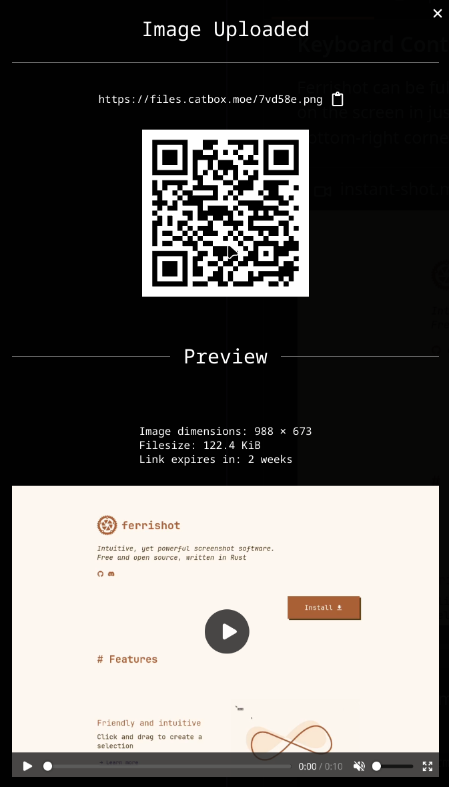

<div align="center">
  <p>
    <h1>
      <a href="https://github.com/nik-rev/ferrishot">
        
      </a>
      <br />
      ferrishot
    </h1>
    <h4>Screenshot app written in Rust, inspired by <a href="https://github.com/flameshot-org/flameshot">flameshot<a />.</h4>
  </p>
  <p align="center">
    <a href="https://github.com/nik-rev/ferrishot/releases">
      
    </a>
    <a href="https://discord.gg/hvaNHymCVy">
      
    </a>
  </p>
</div>

## Showcase

<https://github.com/user-attachments/assets/ebbbfe85-b81e-4f26-9453-545dd1b2ce38>

## Features

Run by typing `ferrishot` on the command line.

### Basic usage

- Select a region on the screen by left clicking and dragging.
- Resize the region by dragging on any of the sides and dragging
- Move the region around by dragging in the center

The selection is surrounded by buttons, each with their own keybinding. Most notably:

- `Enter` copies screenshot to clipboard
- `Ctrl s` saves screenshot to a file. You can choose any valid extension like `.png`, `.webp`, `.jpg`
- `Ctrl u` uploads the screenshot to the internet

#### Image Uploaded

You get a link and a QR Code, so you can easily send it to another device!



### Size Indicator

In the bottom-right corner, is a small box showing the height and width of the selection.
You can manually edit it to set a specific size.

### Keyboard Control

Ferrishot can be fully keyboard controlled, with no mouse! You can select any region on the screen in just
8 keystrokes. Pick a top-left corner by typing `t`, and pick a bottom-right corner by typing `b`:

<https://github.com/user-attachments/assets/7b013780-4213-4770-bbb4-6c9c8a383eb3>

We also have vim motions! There is a cheatsheet available by pressing `?` to view the motions:


You can see all of the keybindings declared in the default config file [`default.kdl`](./default.kdl)

### Config

Ferrishot is very customizable! You have _full_ control over the UI, color scheme and keybindings.

Create the default config file `ferrishot.kdl` by doing `ferrishot --dump-default-config`.

For reference, see the [default config file (`default.kdl`)](./default.kdl) which contains comments describing each option.

### Command-line interface

You can use `ferrishot` in scripts, too

#### `ferrishot`

A cross-platform desktop screenshot app

**Usage:** `ferrishot [OPTIONS]`

###### **Options:**

- `-r`, `--region <WxH+X+Y>` — Open with a region pre-selected

  Format: `<width>x<height>+<top-left-x>+<top-left-y>`

- `-l`, `--last-region` — Use last region
- `-a`, `--accept-on-select <ACTION>` — Accept capture and perform the action as soon as a selection is made

  If holding `ctrl` while you are releasing the left mouse button on the first selection,
  the behavior is cancelled

  It's quite useful to run ferrishot, select a region and have it instantly be copied to the
  clipboard for example. In 90% of situations you won't want to do much post-processing of
  the region and this makes that experience twice as fast. You can always opt-out with `ctrl`

  Using this option with `--region` or `--last-region` will run ferrishot in 'headless mode',
  without making a new window.

  Possible values:

  - `copy`:
    Copy image to the clipboard
  - `save`:
    Save image to a file
  - `upload`:
    Upload image to the internet

- `-d`, `--delay <MILLISECONDS>` — Wait this long before launch
- `-s`, `--save-path <PATH>` — Instead of opening a file picker to save the screenshot, save it to this path instead
- `-D`, `--dump-default-config` — Write contents of the default config to /home/e/.config/ferrishot.kdl
- `-C`, `--config-file <file.kdl>` — Use the provided config file

  Default value: `/home/e/.config/ferrishot.kdl`

- `-S`, `--silent` — Run in silent mode. Do not print anything
- `-j`, `--json` — Print in JSON format

## Platform Support

- [x] Windows
- [x] MacOS
- [x] Linux (X11)
- [x] Linux (Wayland)

## Installation

### Homebrew

```sh
brew install nik-rev/tap/ferrishot
```

### PowerShell

```sh
powershell -ExecutionPolicy Bypass -c "irm https://github.com/nik-rev/ferrishot/releases/latest/download/ferrishot-installer.ps1 | iex"
```

### Shell

```sh
curl --proto '=https' --tlsv1.2 -LsSf https://github.com/nik-rev/ferrishot/releases/latest/download/ferrishot-installer.sh | sh
```

### Nix

Add it to your `flake.nix`:

```nix
# add it to your inputs
inputs.ferrishot.url = "github:nik-rev/ferrishot/main";
# then use it in home-manager for example
inputs.ferrishot.packages.${pkgs.system}.default
```

### Arch AUR

```sh
yay -S ferrishot-bin
```

### Cargo

If you use Linux, see [`CONTRIBUTING.md`](./CONTRIBUTING.md) for details on which dependencies you will need.

```sh
cargo install ferrishot
```

## Contributing

See [`CONTRIBUTING.md`](./CONTRIBUTING.md)
